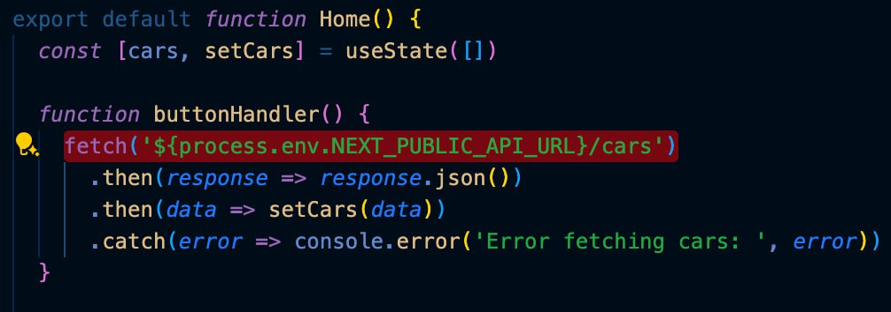
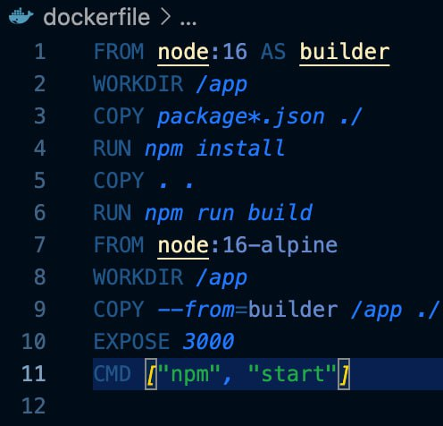
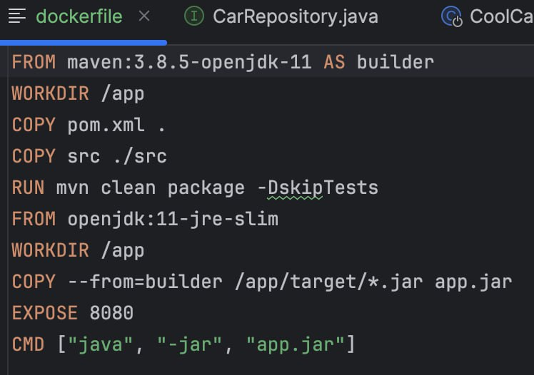

Hier befindet sich Projekt Cool Cars vom Modul 347, dieses Projekt dient dazu Cloud Architektur besser kennenzulernen und praktisch anzuwenden.

Referenzen:  
12.4 Projekt Laufzeitumgebung Cool Cars.pdf  
[https://gitlab.com/bbwrl/m347-ref-card-03-be](https://gitlab.com/bbwrl/m347-ref-card-03-be)  
[https://gitlab.com/bbwrl/m347-ref-card-03-fe](https://gitlab.com/bbwrl/m347-ref-card-03-fe)

1. Frontend und Backend von Git Repo clonen

2. Frontend und Backend lokal laufen lassen

3. Erstellen einer neuen Datei namens "config.env.local" mit dem Inhalt: "NEXT_PUBLIC_API_URL=http://localhost:8080

4. Frontend mit dem Backend verbinden  

5. Knopf für die Backend Connection im Frontend hinzugefügt

6. Wahl der Container Registry
Wir haben uns dazu entschieden AWS zu benutzen, da wir damit am meisten Erfahrung haben.

7. Dockerfile für Frontend

8. Dockerfile für Backend

9. Docker Compose File schreiben

10. Docker Container Lokal laufen lassen
